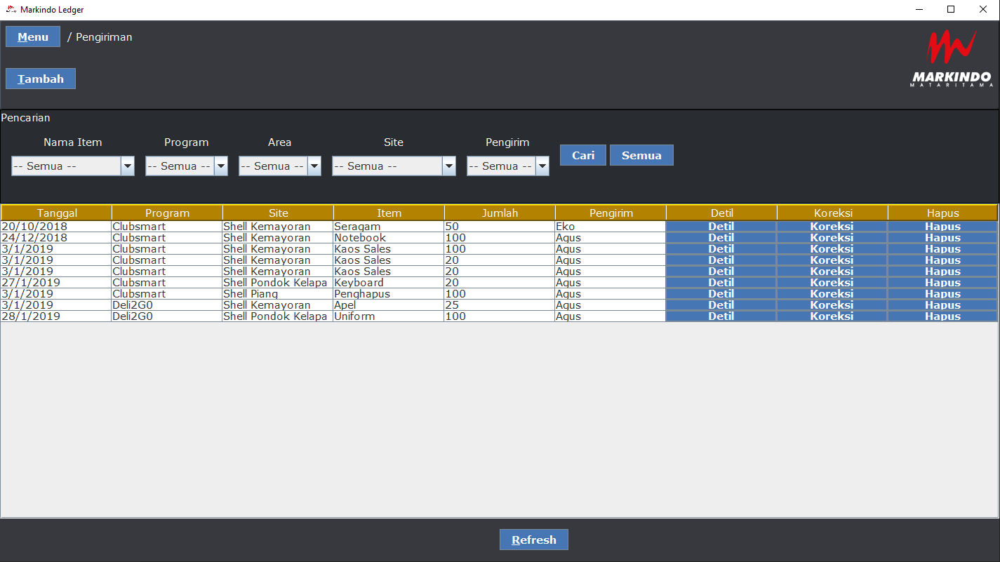

<div id="top"></div>

<!-- PROJECT SHIELDS -->
<!--
*** I'm using markdown "reference style" links for readability.
*** Reference links are enclosed in brackets [ ] instead of parentheses ( ).
*** See the bottom of this document for the declaration of the reference variables
*** for contributors-url, forks-url, etc. This is an optional, concise syntax you may use.
*** https://www.markdownguide.org/basic-syntax/#reference-style-links
-->
<!-- [![Contributors][contributors-shield]][contributors-url]
[![Forks][forks-shield]][forks-url]
[![Stargazers][stars-shield]][stars-url]
[![Issues][issues-shield]][issues-url]
[![MIT License][license-shield]][license-url] -->
<!-- [![LinkedIn][linkedin-shield]][linkedin-url] -->


<!-- PROJECT LOGO -->
<br />
<div align="center">
  <!-- <a href="https://github.com/GiantSweetroll/Mod-Analyzer">
    
  </a> -->

  <h3 align="center">Markindo Ledger</h3>

  <p align="center">
    A ledger software for Markindo Mataritama company to keep track of their stocks and deliveries
  </p>
</div>
<br>


<!-- TABLE OF CONTENTS -->
<details>
  <summary>Table of Contents</summary>
  <ol>
    <li>
      <a href="#about-the-project">About The Project</a>
      <ul>
        <li><a href="#built-with">Built With</a></li>
      </ul>
    </li>
    <li>
      <a href="#getting-started">Getting Started</a>
      <ul>
        <li><a href="#prerequisites">Prerequisites</a></li>
        <li><a href="#installation">Installation</a></li>
      </ul>
    </li>
    <li><a href="#usage">Usage</a></li>
    <!-- <li><a href="#roadmap">Roadmap</a></li> -->
    <!-- <li><a href="#contributing">Contributing</a></li> -->
    <!-- <li><a href="#license">License</a></li> -->
    <!-- <li><a href="#acknowledgments">Acknowledgments</a></li> -->
    <li><a href="#screenshots">Screenshots</a></li>
  </ol>
</details>


<!-- ABOUT THE PROJECT -->
## About The Project


This project was part of my project for IB DP ITGS Internal Assessment.

Pt Markindo Mataritama is a marketing agent company. They help their clients by providing support in their marketing programs in an effort to increase sales. The company has a lot of things that they do to achieve their goal or target. One of which is data management between stock and deliveries. Problem is, the data between stock and deliveries are not integrated with one another. They are kept separate. This reduces data accuracy and may lead to inconsistent data or values between items. This issue may lead to bad relation between Pt Markindo Mataritama and their clients.

They need to keep track of data of stock and deliveries of items. The number of items delivered needs to correlate with the data from stock. This is to prevent delivering the number of items incorrectly. Since the two sets of data are currently kept separate, this is a likely issue to happen. As he has said, the solution to this issue is to have an application that would integrate the data from stock and deliveries together. Doing this will far reduce data inaccuracy or inconsistency as the number of items delivered would have a direct relation to the stock.

<div align="right">(<a href="#top">back to top</a>)</div>


### Built With

This project was made using [Java](https://www.java.com/en/).

<div align="right">(<a href="#top">back to top</a>)</div>


<!-- GETTING STARTED -->
## Getting Started

To get a local copy of the project up and running , follow these simple steps.

### Prerequisites
- JDK 8 (or newer)
- [GG-Library](https://github.com/GiantSweetroll/GG-Library)
- [Eclipse](https://www.eclipse.org/ide/) (Optional)

<i>Note: This project was created using the Eclipse IDE and is recommended to open and edit the contents of the project. You may use other IDEs that suits your best.</i>

### Installation

1. Clone the repo
   ```sh
   git clone https://github.com/GiantSweetroll/Markindo-Ledger.git
   ```
2. Configure the build path to point to where you downloaded GG-Library and JDK in your local machine
3. Run `MainFrame.java` inside `src/gui/`.

<div align="right">(<a href="#top">back to top</a>)</div>


<!-- USAGE EXAMPLES -->
## Usage
The app is in Indonesian.

To see how to use the app (in english), please refer to this video demo [here](https://youtu.be/1lm8eCvmGCU).

<div align="right">(<a href="#top">back to top</a>)</div>

<!-- SCREENSHOTS -->
## Screenshots

<details>
    <summary>Screenshots</summary>
    
    
    
    
    
    
    
</details>

<div align="right">(<a href="#top">back to top</a>)</div>
